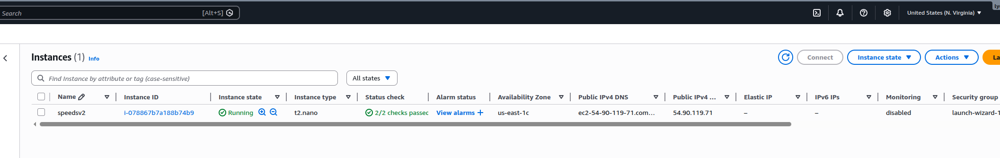
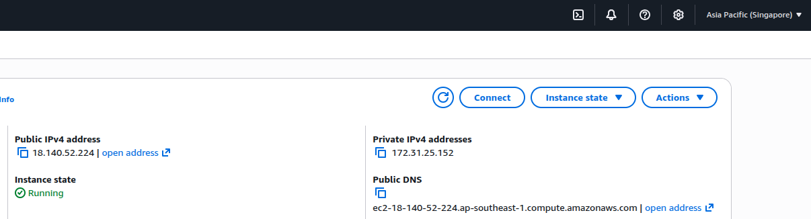

# Network Bandwidth Measurement (JS)

This project provides a browser-based speed test that measures:

- Download speed (Mbps)
- Upload speed (Mbps)
- Latency (ms)
- Jitter (ms)

It uses same-origin API endpoints to avoid CORS issues and improve result consistency.

## Requirements

- Node.js 18+ (or any runtime that supports the project dependencies)
- npm

## Run Locally

1. Install dependencies:

   ```bash
   npm install
   ```

2. Start the server:

   ```bash
   npm start
   ```

3. Open:

   [http://localhost:3000](http://localhost:3000)

## API Endpoints

- `GET /api/ping`
  - Lightweight endpoint used for RTT samples.

- `GET /api/download?sizeMb=N`
  - Streams a deterministic binary payload for download speed measurement.
  - `N` is clamped to `1..200` MB.

- `POST /api/upload`
  - Accepts `application/octet-stream` payload and returns the number of bytes received.

## Notes and Limitations

- Browser/device load affects measurements.
- Shared server resources can skew results.
- Run multiple times and compare averages for better confidence.


## Benchtest

### Screenshots





### Demo video

- Download/watch: [`demo.webm`](./demo.webm)
- If your markdown renderer supports HTML video tags:

<video src="./demo.mp4" controls style="max-width: 100%;"></video>

